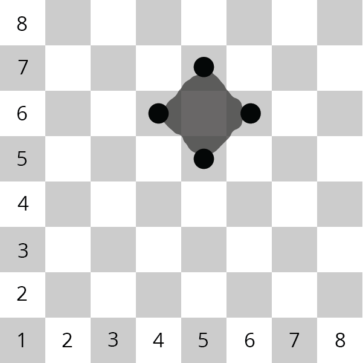

The Defense of Consolas
-
The Uncoded One has begun an assault on the city of Consolas; the
situation is dire. From a moving airship called the Manticore,
massive fireballs capable of destroying city blocks are being
catapulted into the city.
The city is arranged in blocks, numbered like a chessboard.
The city’s only defense is a movable magical barrier, operated by a
squad of four that can protect a single city block by putting
themselves in each of the target’s four adjacent blocks, as shown in
the picture to the right.




For example, to protect the city block at (Row 6, Column 5), the
crew deploys themselves to (Row 6, Column 4), (Row 5, Column 5),
(Row 6, Column 6), and (Row7, Column 5).
The good news is that if we can compute the deployment locations fast enough, the crew can be
deployed around the target in time to prevent catastrophic damage to the city for as long as the siege
lasts. The City of Consolas needs a program to tell the squad where to deploy, given the anticipated
target. Something like this:


```
Target Row? 6
Target Column? 5
Deploy to:
(6, 4)
(5, 5)
(6, 6)
(7, 5)
```
	
---
#### Objectives:
- Create a program that allows users to enter how many provinces, duchies, and estates they have.
- Add up the user’s total score, giving 1 point per estate, 3 per duchy, and 6 per province.
- Display the point total to the user.

