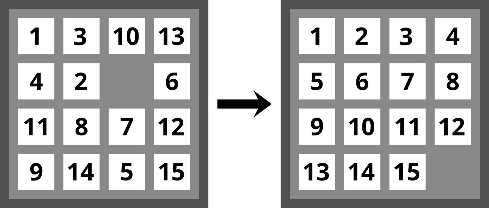

15-Puzzle
-
The second pedestal requires you to provide an object-oriented design for the game of 15-Puzzle.

The game of 15-Puzzle contains a set of numbered tiles on a board with a single open slot. The goal is to
rearrange the tiles to put the numbers in order, with the empty space in the bottom-right corner.
- The player needs to be able to manipulate the board to rearrange it.
- The current state of the game needs to be displayed to the user.
- The game needs to detect when it has been solved and tell the player they won.
- The game needs to be able to generate random puzzles to solve.
- The game needs to track and display how many moves the player has made.

---
#### Objectives:
- Use CRC cards (or a suitable alternative) to outline the objects and classes that may be needed to 
  make the game of 15-Puzzle. You do not need to create this full game; just come up with a 
  potential design as a starting point.
- Answer this question: Would your design need to change if we also wanted 3×3 or 5×5 boards? 

---
My solution (CRC class-responsibilities-collaborators):
- The solution would not change with a 3x3 or different size board. Only the array size would need to change.

- The first class BOARD handles the logic to move a tile

|BOARD |
|---|---|
|knows the state of board		|   |
|display the numbers on board   |   |
|slide the tiles				|   |
|determine if game is won		|   |
|   |   |

- The second class PLAYER allows the user to play

|PLAYER |
|---|---|
|get commands to move from user		| Board  |
|track the move count				|   |
|   |   |

- The third class GENERATOR initializes the board

|GENERATOR |
|---|---|
|initialize the board   | Board   |
|   |   |

- The last class GAME orchestrates the Game 

|GAME |
|---|---|
|maange the game	| Player  |
|					| Board  |
|					| Generator  |
|   |   |