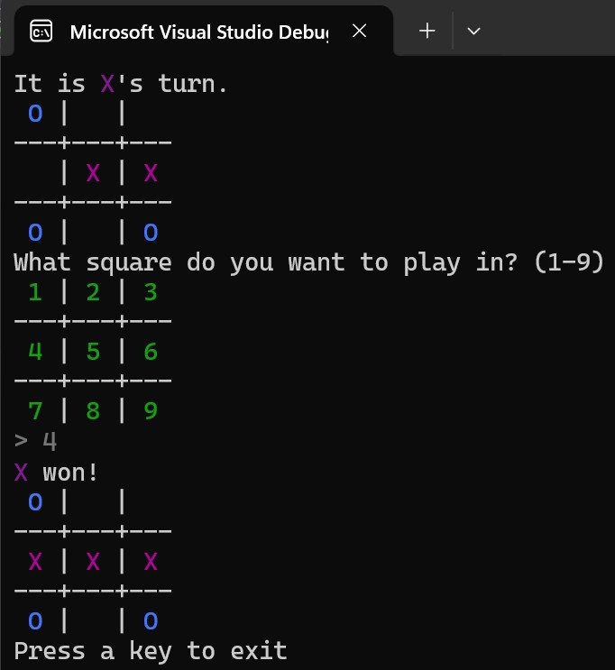

Tic-Tac-Toe
-
Completing designs for the three games in the Chamber of Design causes the pedestals to light up red
again, and another door opens, letting you into the final chamber. This chamber has only a single large,
broad pedestal. Inscribed on the stone floor in a circle around the pedestal are the engraved words, “Only
a True Programmer can build object-oriented programs.”

More text engraved on the pedestal describes what you recognize as the game of Tic-Tac-Toe, stating
that in ancient times, inhabitants of the land would use this as a Battle of Wits to determine the outcome
of political strife. Instead of fighting wars, they would battle it out in a game of Tic-Tac-Toe.

Your job is to recreate the game of Tic-Tac-Toe, allowing two players to compete against each other. The
following features are required:
- Two human players take turns entering their choice using the same keyboard.
- The players designate which square they want to play in. Hint: You might consider using the number 
  pad as a guide. For example, if they enter 7, they have chosen the top left corner of the board.
- The game should prevent players from choosing squares that are already occupied. If such a move
  is attempted, the player should be told of the problem and given another chance.
- The game must detect when a player wins or when the board is full with no winner (draw/”cat”).
- When the game is over, the outcome is displayed to the players.
- The state of the board must be displayed to the player after each play. Hint: One possible way to 
  show the board could be like this:

```
It is X's turn.
   | X |
---+---+---
   | O | X
---+---+---
 O |   |
What square do you want to play in?
```

---
#### Objectives:
- Build the game of Tic-Tac-Toe as described in the requirements above. Starting with CRC cards is 
  recommended, but the goal is to make working software, not CRC cards.
- Answer this question: How might you modify your completed program if running multiple rounds 
  was a requirement (for example, a best-out-of-five series)?

---
My solution (CRC class-responsibilities-collaborators):



- The first class PROGRAM handles the setup of the game and runs it

|PROGRAM ||
|---|---|
|Set up and start the game		|   |
|   |   |

- The second class GAME allows to play next rounds

|GAME ||
|---|---|
|Display the board		| Board  |
|Get move from player	| Player  |
|Decide if it is a win/lose   |   |
|   |   |

- The third class PLAYER handles the choices of player

|Player ||
|---|---|
|Ask for a square (1..9) 			| Board  |
|Enure choice is good				|   |
|Ask for a choice (X or O)			|	|
|Display state of board				|   |
|									|	|

- The fourth class BOARD RENDER handles the display of the Board

|BOARD RENDER ||
|---|---|
|Display current state of game	| Board	|
|								| Console		|
|								|			|

- The fifth class BOARD validates the placement in the grid

|BOARD ||
|---|---|
|Knows the state (X, O, Blank) in grid	| Board	|
|Allows placement of X or O				| |
|										| |

